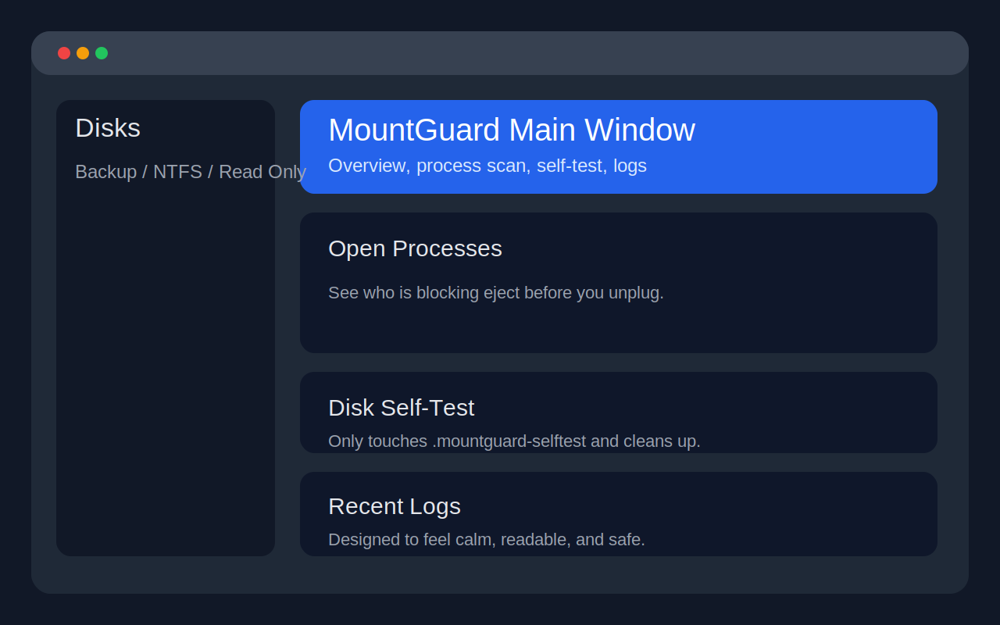
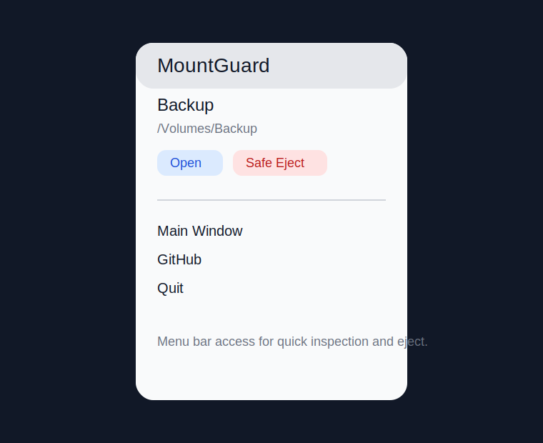
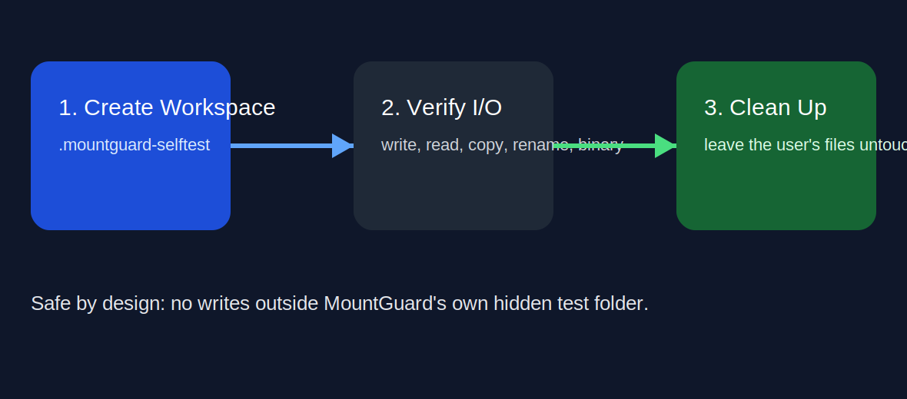

# MountGuard

[中文说明](./README.zh-CN.md) | [Testing Guide](./docs/TESTING.md) | [Release Guide](./docs/OPEN_SOURCE_RELEASE.md)

MountGuard makes external disks feel simpler, safer, and less annoying on macOS.

## What Problem It Solves

- You are not sure whether a disk is mounted, writable, or safe to eject.
- macOS says the disk is busy, but does not tell you what is holding it.
- You want a quick health check without risking your real files.
- You just want a small native tool that helps you get back to work.

## What Value You Get

- See your external disks clearly in one place
- Find blocking processes before unplugging
- Eject in a safer order: `sync -> unmount -> eject`
- Run a self-test that only touches `.mountguard-selftest`
- Use the app in English or Chinese

## Start Here

### Launch the app

```bash
./scripts/run-local-app.sh
```

### List disks

```bash
swift run --disable-sandbox mountguardctl list
```

### Check what is blocking a disk

```bash
swift run --disable-sandbox mountguardctl ps disk4s2
```

### Run the safe self-test

```bash
swift run --disable-sandbox mountguardctl selftest disk4s2
```

### Eject only when you really mean it

```bash
swift run --disable-sandbox mountguardctl eject disk4s2
```

## Screenshots

### Main Window



### Menu Bar Panel



### Self-Test Workflow



## How To Think About It

- `Open`: jump into the disk in Finder
- `Scan Usage`: ask who is still holding the disk
- `Run Self-Test`: verify the I/O path using MountGuard's own hidden workspace
- `Safe Eject`: flush, unmount, and eject in a safer order

If a volume is read-only, MountGuard respects that and skips write self-tests instead of pretending everything is fine.

## Real Usage Stories

### “I just want to unplug safely.”

Open MountGuard, pick the disk, run `Scan Usage`, and then `Safe Eject`.

### “I am not sure whether the disk path is healthy.”

Run the self-test. It creates files only inside `.mountguard-selftest`, validates read/write behavior, and cleans up after itself.

### “I mainly live in Terminal.”

Use:

```bash
swift run --disable-sandbox mountguardctl list
swift run --disable-sandbox mountguardctl ps <diskIdentifier>
swift run --disable-sandbox mountguardctl selftest <diskIdentifier>
swift run --disable-sandbox mountguardctl eject <diskIdentifier>
```

## Why It Feels Safe

- No automatic formatting
- No automatic `fsck`
- No silent process killing
- No hidden remount tricks
- No write self-test on read-only volumes
- No writes outside MountGuard-owned test workspace

## Current Status

- `swift test --disable-sandbox` passes
- The current debug disk `/Volumes/Backup` is correctly identified as `NTFS` and `read-only`
- Real self-test on that disk is intentionally skipped instead of forcing unsafe writes
- Busy-process scan has been switched to a filesystem-level strategy so large disks stay responsive

## Technical Details

- Native macOS stack: `SwiftUI + AppKit + DiskArbitration + diskutil`
- Menu bar app + CLI with shared system services
- Busy-process scan before eject
- English-first GUI with Chinese toggle

## Later

This phase stops here on purpose.

Future ideas like verified sync, resumable copy, and backup workflows are tracked in [Advanced Capabilities](./docs/ADVANCED_CAPABILITIES.md) and [Next Phase](./docs/NEXT_PHASE.md).

## For Contributors

- Start here: [CONTRIBUTING.md](./CONTRIBUTING.md)
- Review safety boundaries: [SECURITY.md](./SECURITY.md)
- Understand privacy posture: [PRIVACY.md](./docs/PRIVACY.md)
- Release cleanly: [OPEN_SOURCE_RELEASE.md](./docs/OPEN_SOURCE_RELEASE.md)
