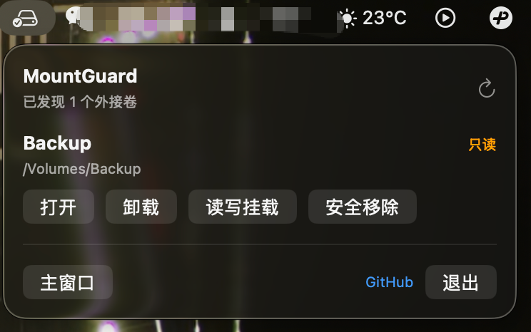
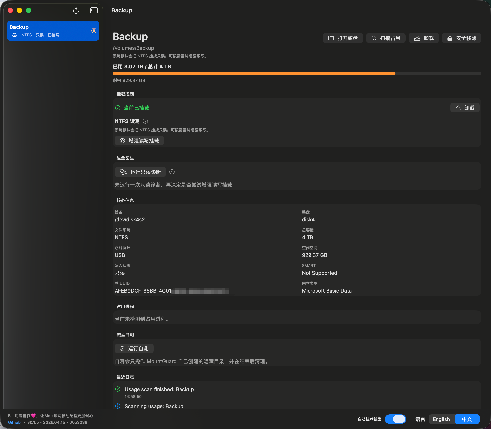

# MountGuard

[English README](./README.md) | [开发指南](./docs/DEVELOPMENT.md) | [测试指南](./docs/TESTING.md) | [发布指南](./docs/OPEN_SOURCE_RELEASE.md)

MountGuard 是一个原生 macOS 外接磁盘管理工具，主线只有一条：

- 快速挂载
- 真实显示能不能写
- NTFS 不冒险乱写
- 在写入前先诊断、先修复、再决定是否读写
- 拷完之后更稳地安全移除

## UI 预览






## 它解决什么问题

很多磁盘工具只能告诉你“盘在这里”。

MountGuard 更关心的是：

- 现在到底有没有挂载
- 当前到底是不是可写
- 这块 NTFS 盘现在能不能放心开始拷大文件
- 如果不能，应该怎么诊断、怎么修、能不能在 Mac 上先处理

## 核心流程

```text
插入磁盘
   |
   v
MountGuard 刷新状态
   |
   +--> 已挂载 + 可写 ----------> Finder 打开 ----------> 双向拷贝
   |
   +--> 已挂载 + 只读 ----------> 运行磁盘医生 ----------> 修复 / 保持只读
   |
   +--> 未挂载 -----------------> GUI / 菜单栏挂载 -------> 重试
```

## 为什么更安心

- 不自动格式化
- 不偷偷杀进程
- 不把只读盘伪装成可写盘
- 只读卷绝不强行写入型自测
- 不在 MountGuard 自己的工作区之外乱写文件
- 磁盘医生判定阻断时，不会继续尝试危险的 NTFS 读写挂载

## 磁盘医生

磁盘医生现在不是只会“看病”，而是分成两层：

1. 先做只读诊断
2. 如果命中常见 NTFS 阻断项，并且本机具备 `ntfsfix`，再给出可确认的 Mac 本地修复方案

它能识别：

- Windows 快速启动 / 休眠残留导致的 `unsafe state`
- 常见 NTFS 损坏信号
- `diskutil verifyVolume` 对当前 NTFS 卷不适用的情况
- 当前 Mac 是否具备本地自动修复能力

修复链路是这样：

```text
只读诊断
   |
   v
输出修复计划
   |
   v
用户确认
   |
   v
MountGuard 调用 ntfsfix
   |
   v
重新诊断
   |
   v
只有阻断项消失，才建议再次尝试增强读写挂载
```

要点说明：

- MountGuard 可以在 macOS 上自动化执行一次谨慎的 `ntfsfix` 修复
- 它适合解决常见 NTFS 挂载阻断
- 它不是 Windows `chkdsk` 的完整替代
- 如果修复后仍然是 `Blocked`，MountGuard 会继续保持保守态，不会强闯写入

## 界面预览

真实截图后面可以再补，现在先用字符图表达结构：

```text
+---------------------------------------------------------------+
| MountGuard                                                    |
| 磁盘列表                      | Backup Drive                  |
|------------------------------|-------------------------------|
| Backup Drive  NTFS  只读      | 挂载控制                      |
| Media SSD     exFAT 可写      | [挂载] [打开] [扫描] [移除]   |
| Archive       APFS  已挂载    |                               |
|                              | 磁盘医生                      |
|                              | [运行只读诊断]                |
|                              | 状态: 阻断                    |
|                              | - 检测到 unsafe state         |
|                              | - 建议先修复                  |
|                              | 修复计划                      |
|                              | [在 Mac 上尝试修复]           |
|                              |                               |
|                              | 自测 / 日志 / 核心信息        |
+---------------------------------------------------------------+
```

## 快速开始

### 从 DMG 安装

1. 打开最新的 [GitHub Release](https://github.com/BillLucky/MountGuard-for-Mac/releases/latest)。
2. 下载最新 DMG。
3. 把 `MountGuard.app` 拖进 `Applications`。
4. 从 `Applications` 启动。

这是普通用户最推荐的使用路径。

### 直接使用 GUI

启动后，典型流程是：

1. 在左侧选中外接磁盘
2. 使用 `挂载`、`打开`、`磁盘医生`、`安全移除`
3. 只有在磁盘医生没有阻断时，才继续尝试 `增强读写挂载`

### 如果首次启动被拦截

- 右键 `MountGuard.app`
- 选择 `打开`
- 再确认一次

原因：

- 当前 release 已经做了 App Bundle 签名，避免包体结构被系统判成损坏
- 但在完整公证链路接入前，Gatekeeper 仍可能在首次启动时要求你手动确认一次

## 开发者工具

下面这些命令面向开发、诊断和贡献者工作流，不是普通用户的首选入口。

### 从源码运行 GUI

```bash
./scripts/run-local-app.sh
```

### 常用 CLI

```bash
swift run --disable-sandbox mountguardctl list
swift run --disable-sandbox mountguardctl doctor <diskIdentifier>
swift run --disable-sandbox mountguardctl doctor-repair <diskIdentifier>
```

### 开发者继续看

[开发指南](./docs/DEVELOPMENT.md) 里补充了：

- 本地环境准备
- 编译与打包
- 签名与首次启动
- release 流程

## 文件系统策略

- `APFS`、`HFS+`、`exFAT`：优先走系统默认挂载路径，稳定和速率优先
- `NTFS`：先安全挂载，再诊断，再决定是否增强读写
- 多块外接磁盘：统一走主窗口和菜单栏同一套状态与动作

## 当前版本重点

- 稳定挂载与状态刷新
- 清楚区分可写与只读
- NTFS 的诊断、阻断和 Mac 本地修复计划
- 更安全的占用扫描与移除流程
- GUI 内可见版本号、日期、commit
- 中英双语基础

## 给开发者

- 原生 macOS 技术栈：`SwiftUI + AppKit + DiskArbitration + diskutil`
- 菜单栏、GUI、CLI 共用同一套核心服务
- `磁盘医生` 与 `增强读写挂载` 共享同一套安全门禁
- 仓库不会继续跟踪私有规划文档和本地敏感信息

## 后续路线

更大的能力，比如校验式同步、断点续传、备份工作流，放在 [Advanced Capabilities](./docs/ADVANCED_CAPABILITIES.md) 和 [Next Phase](./docs/NEXT_PHASE.md)。

## 给贡献者

- 从这里开始：[CONTRIBUTING.md](./CONTRIBUTING.md)
- 安全边界：[SECURITY.md](./SECURITY.md)
- 隐私说明：[PRIVACY.md](./docs/PRIVACY.md)
- 发布流程：[OPEN_SOURCE_RELEASE.md](./docs/OPEN_SOURCE_RELEASE.md)
